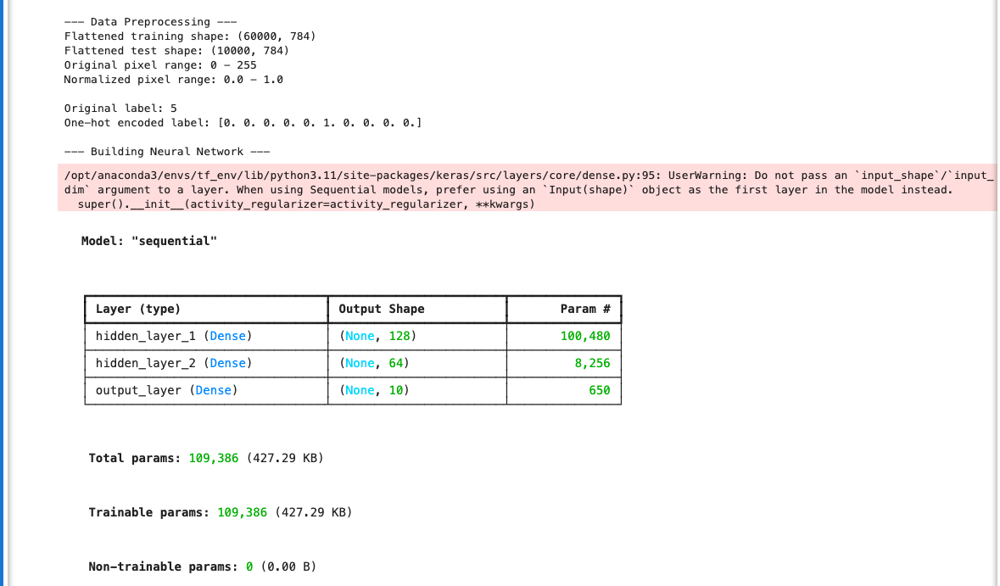
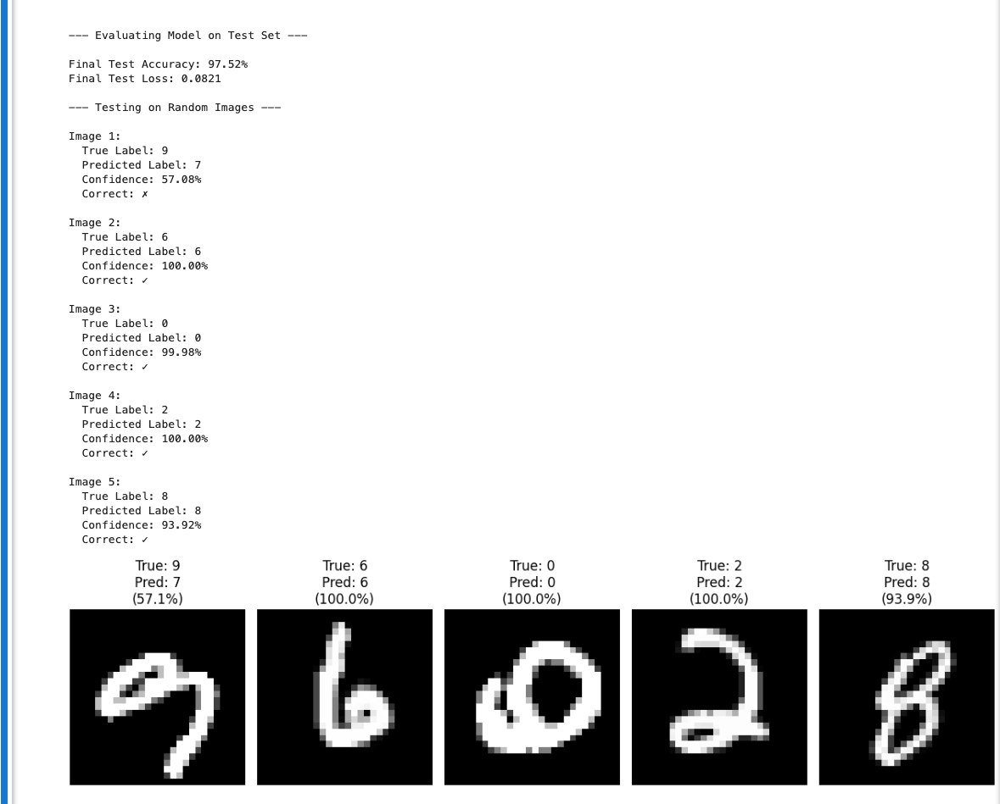
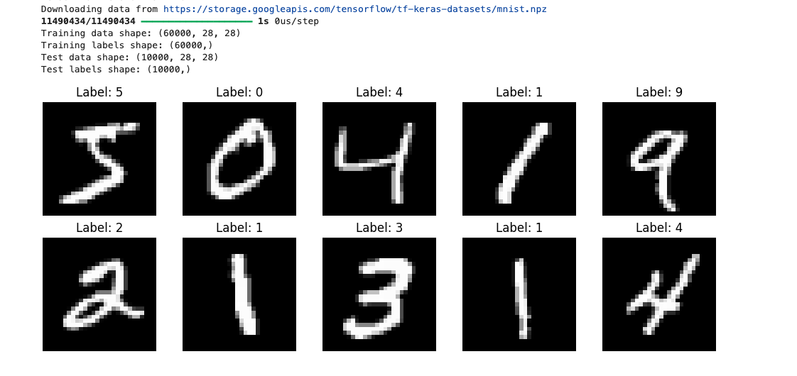
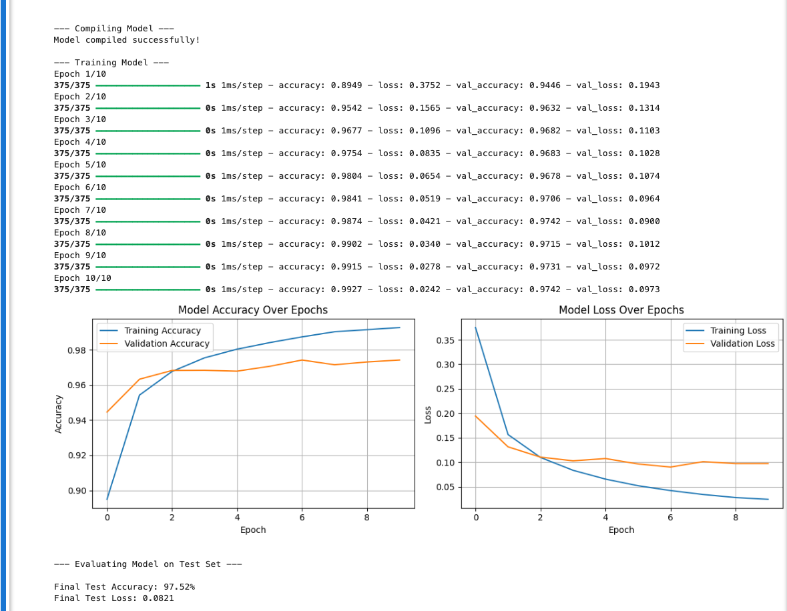
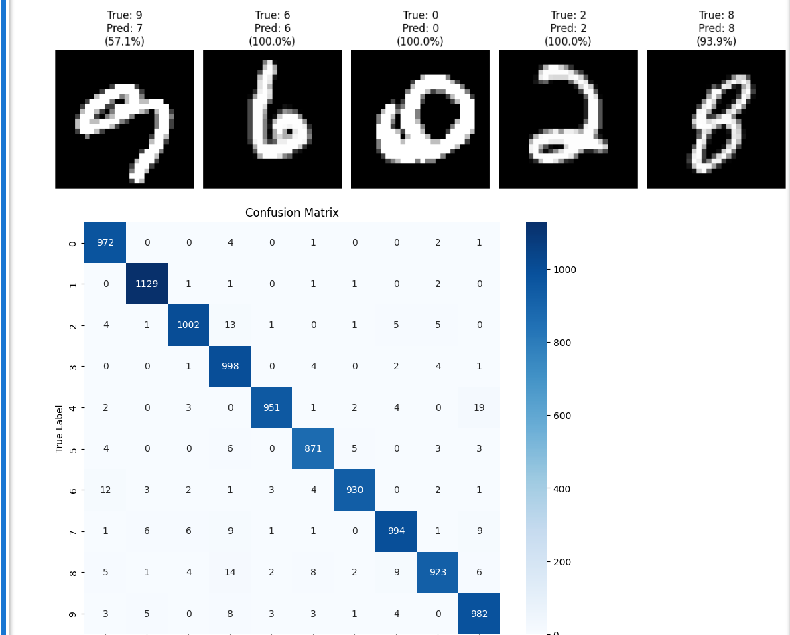
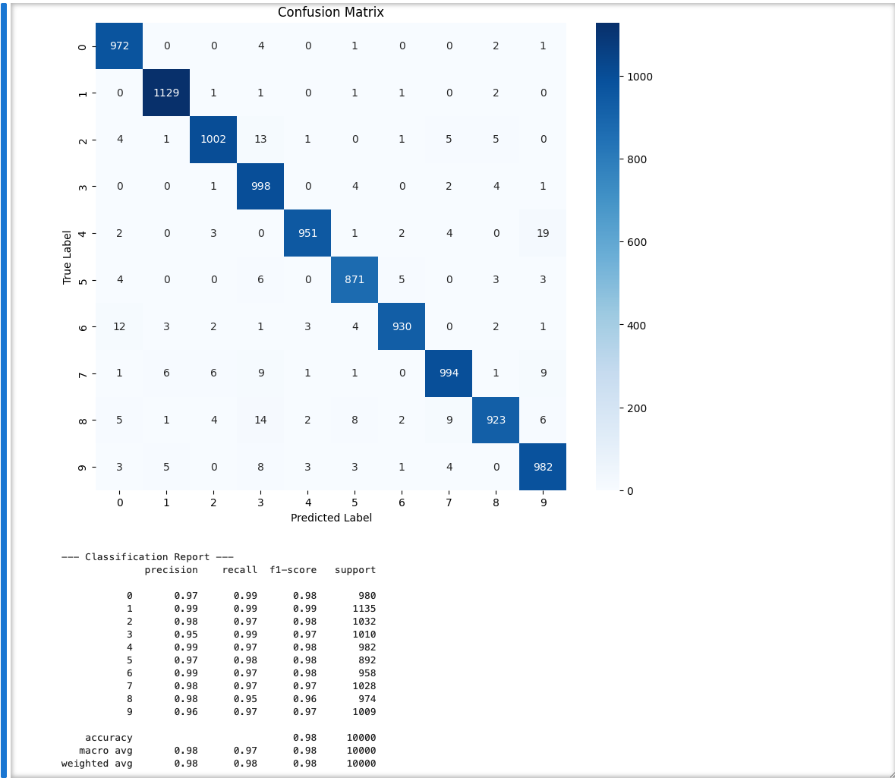

# AI-ML-Assignment-3-Simple-NN

## MNIST Digit Classification using Feedforward Neural Network

**Author:** Ermiyas H.
**Framework:** TensorFlow/Keras  
**Date:** 04/11/25 
**Environment:** Python 3.11 (Anaconda tf_env)

---

## Results

**Final Test Set Accuracy:** 97.52%  
**Final Test Loss:** 0.0821

---

## Model Architecture

- **Input Layer:** 784 neurons (28×28 flattened)
- **Hidden Layer 1:** 128 neurons, ReLU activation
- **Hidden Layer 2:** 64 neurons, ReLU activation
- **Output Layer:** 10 neurons, Softmax activation
- **Total Parameters:** 109,386

---

## Training Configuration

- **Optimizer:** Adam
- **Loss Function:** Categorical Cross-Entropy
- **Epochs:** 10
- **Batch Size:** 128
- **Validation Split:** 20%

---

## Files
## Project Structure
```
AI-ML-Assignment-3-Simple-NN/
├── AI-ML-Assignment-3-Simple-NN.ipynb    # Main notebook
├── README.md                              # Documentation
└── screenshots/                           # Result visualizations
    ├── sample_data.png
    ├── model_architecture.png
    ├── training_progress.png
    ├── test_results.png
    ├── sample_predictions.png
    └── confusion_matrix.png
```
---

## How to Run
```bash
# Create Python 3.11 environment
conda create -n tf_env python=3.11 -y
conda activate tf_env
pip install tensorflow numpy matplotlib scikit-learn seaborn jupyter

# Run Jupyter
jupyter notebook
```

---

## Dependencies

- TensorFlow 2.20.0
- Keras 3.12.0
- NumPy 2.1.3
- Matplotlib 3.10.0
- scikit-learn 1.6.1
- seaborn 0.13.2

---

## Screenshots

The images below illustrate the model architecture, training progress, sample inputs and predictions, test results, and the confusion matrix. All images are in the `screenshots/` folder.


*Figure: Model architecture diagram.*


*Figure: Training and validation accuracy/loss over epochs.*


*Figure: Example MNIST digits from the dataset.*


*Figure: Sample predictions on test images.*


*Figure: Final test metrics and evaluation.*


*Figure: Confusion matrix for test set predictions.*

## Dataset Information

**MNIST Handwritten Digits:**
- Training samples: 60,000
- Test samples: 10,000
- Image size: 28×28 pixels (grayscale)
- Classes: 10 (digits 0-9)
- Source: Automatically downloaded via TensorFlow/Keras

---

## Key Preprocessing Steps

1. **Flattening:** Converted 28×28 2D images to 784-dimensional 1D vectors
2. **Normalization:** Scaled pixel values from [0, 255] to [0, 1] range
3. **One-Hot Encoding:** Converted integer labels to categorical format
